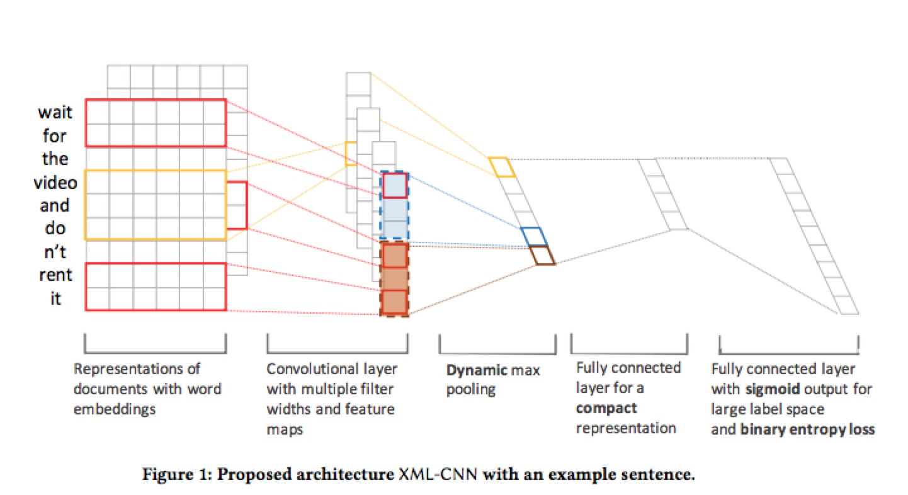
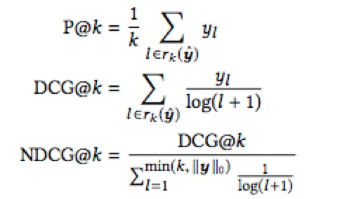

# Deep Learning for Extreme Multi-label Text Classification [1]

## Keywords
multi-label, extreme text classification, deep learning, convolutional neural network

## Concepts
Extreme multi-label text classification(XMTC): The problem of assigning to each document its most relevant subset of class labels from an extremely large label collection, where the number of labels could reach hundreds of thousands or millions.

## Two categories of methods for XMTC
### Target-Embedding Methods
Target-embedding methods aim to address the data sparse issue
in training XMTC classifiers by finding a set of low-dimensional embeddings of the label vectors for training instances in the target space.

### Tree-based Ensemble Methods
Similar to those in classical decision-tree learn-ing, the new methods introduce a tree structure which recursively partitions the instance space or sub-spaces at each non-leaf node, and has a base classifier at each leaf node which only focuses on a few active labels in that node. Different from traditional decision trees, on the other hand, the new methods learn a hyperplane (equivalent to using a weighted combination of all features) to split the current instance space at each node, instead of selecting a single feature based on information gain (as in classical decision trees) for the spli ing. The hyperplane-based induction is much less greedy than the single-feature based induction of decision trees, and hence potentially more robust for extreme classification with a vast feature space.

## Six methods for text classification
### SLEEC
SLEEC [2] is most representative for target-embedding methods in XMTC. It consists of two steps of learning embeddings and kNN classification.

### FastXML
FastXML [3] is considered the state-of-the-art tree-based method for XMTC. It learns a hierarchy of training instances and optimizes an NDCG-based objective at each node of the hierarchy.

### FastText
FastText [4] is a simple yet e ective deep learning method for multi-class text classi cation. A document representation is con- structed by averaging the embeddings of the words that appear in the document, upon which a so max layer is applied to map the document representation to class labels.

### CNN-Kim
CNN-Kim [5] is one of the  rst a empts of applying convolutional neural networks to text classification. CNN-Kim constructs a document vector with the concatenation of its word embeddings, and then t filters are applied to this concatenated vector in the convolution layer to produce t feature maps, which are in turn fed to a max-over-time pooling layer to construct a t-dimensional document representation. 

### Bow-CNN
Bow-CNN [6] \(Bag-of-word CNN) is another strong method in multi-class classification. It represents each small text region (sev- eral consecutive words) using a bag-of-word indicator vector (called the one-hot vector).

### PD-Sparse
PD-Sparse [7] is a recently proposed max-margin method de- signed for extreme multi-label classification. It does not fall into the three categories in Section 1 (target-embedding methods, tree- based methods, and deep learning methods)

## Model Architecture

## Dynamic Max Pooling
In our model, we adopt a dynamic max pooling scheme, which is similar to [7, 20]. Instead of generating only one feature per  lter, p features are generated to capture richer information. For a document with m words, we evenly divide its m-dimensional feature map into p chunks, each chunk is pooled to a single feature by taking the largest value within that chunk, so that information about di erent parts of the document can be received by the top layers. Under this pooling scheme, each  filter produces a p-dimensional feature (assuming m is dividable by p):

P(c) = [max{c1:m/p},..,max{cm−m/p+1:m}] ∈ Rp

which captures both important features and position information about these important features.

## Loss Function
Binary cross-entropy loss over sigmoid activation when applied to multi-label classification instead of softmax cross-entropy loss when applied to multi-class classification.

## Evaluation Metrics
Precision and Normalized Discounted Cummulated Gains

## Reference
[1] [Jingzhou Liu, Wei-Cheng Chang, Yuexin Wu, and Yiming Yang. 2017. Deep Learning for Extreme Multi-label Text Classification.](https://pdfs.semanticscholar.org/1a03/65567850837931d04126714ae6e2cbfc6270.pdf)

[2] [Kush Bhatia, Himanshu Jain, Purusho am Kar, Manik Varma, and Prateek Jain. 2015. Sparse local embeddings for extreme multi-label classification. In Advances in Neural Information Processing Systems. 730–738.](http://papers.nips.cc/paper/5969-sparse-local-embeddings-for-extreme-multi-label-classification.pdf)

[3] [Yashoteja Prabhu and Manik Varma. 2014. Fastxml: A fast, accurate and stable tree-classifier for extreme multi-label learning. In Proceedings of the 20th ACM SIGKDD international conference on Knowledge discovery and data mining. ACM, 263–272.](http://www.cse.iitd.ac.in/~yashoteja/pubs/prabhu14.pdf)

[4] [Armand Joulin, Edouard Grave, Piotr Bojanowski, and Tomas Mikolov. 2016. Bag of tricks for efficient text classification. arXiv preprint arXiv:1607.01759 (2016).](https://arxiv.org/pdf/1607.01759.pdf)

[5] [Yoon Kim. 2014. Convolutional neural networks for sentence classification. In Proceedings of the 2014 Conference on Empirical Methods in Natural Language Processing (EMNLP). 1746–1751.](https://arxiv.org/pdf/1408.5882.pdf)

[6] [Rie Johnson and Tong Zhang. 2015. Effective use of word order for text categorization with convolutional neural networks. In Proceedings of the 2015 Conference of the North American Chapter of the Association for Computational Linguistics: Human Language Technologie. 103–112.](https://arxiv.org/pdf/1412.1058.pdf)

[7] [Ian EH Yen, Xiangru Huang, Kai Zhong, Pradeep Ravikumar, and Inderjit S Dhillon. 2016. PD-Sparse: A Primal and Dual Sparse Approach to Extreme Multiclass and Multilabel Classification. (2016).](http://proceedings.mlr.press/v48/yenb16.pdf)

