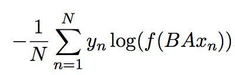
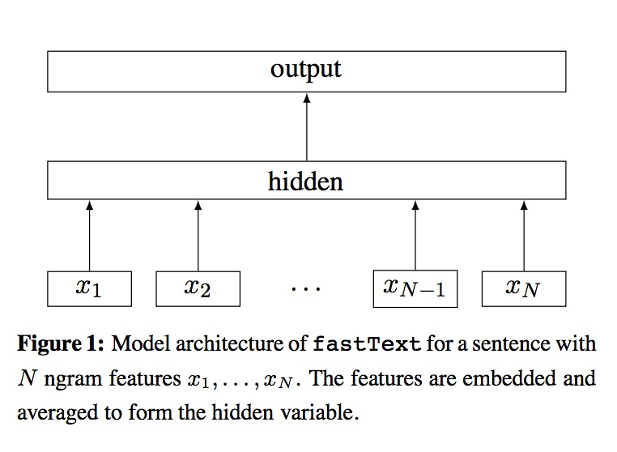

# Bag of Tricks for Efficient Text Classification[1]

## Keywords
Text classification, deep learning

## Model
Figure 1 shows a simple linear model with rank constraint. The first weight matrix A is a look-up table over the words. The word representations are then averaged into a text representation, which is in turn fed to a linear classifier. The text representation is an hidden variable which can be potentially be reused. This architecture is similar to the cbow model of Mikolov et al. (2013), where the middle word is replaced by a label. We use the softmax function f to compute the probability distribution over the predefined classes. For a set of N documents, this leads to minimizing the negative log-likelihood over the classes:

where xn is the normalized bag of features of the n-th document, yn the label, A and B the weight matrices. 

## References
[1] [Joulin, A., Grave, E., Bojanowski, P., & Mikolov, T. (2016). Bag of tricks for efficient text classification. arXiv preprint arXiv:1607.01759.](https://arxiv.org/pdf/1607.01759)