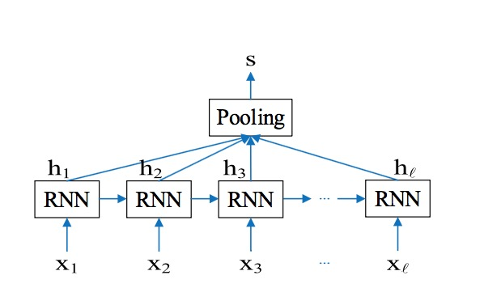
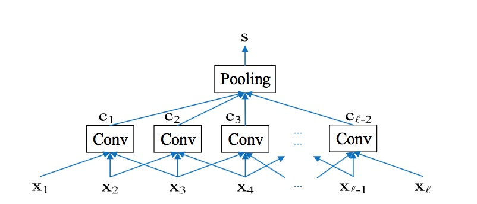
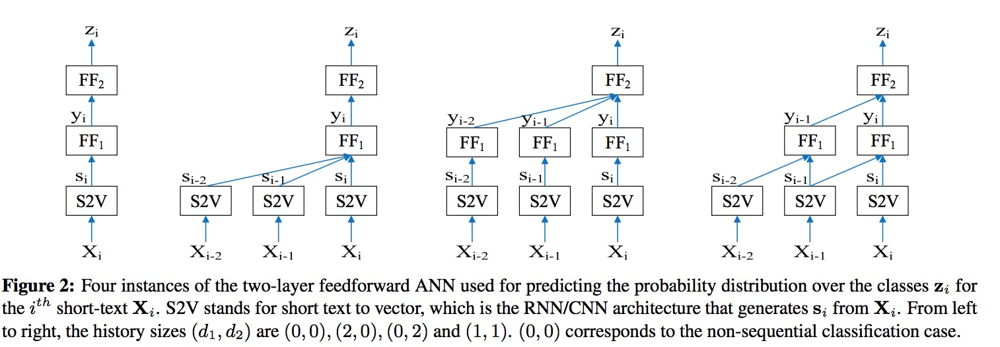

# Sequential Short-Text Classification with Recurrent and Convolutional Neural Networks[1]

## Keywords
CNN, RNN, text classification

## Short-text representation
1. RNN

In the pooling layer, the sequence of vectors h1:l
output from the RNN layer are combined into a single vector s ∈ Rn that represents the short-text, using one of the following mechanisms: last, mean, and max pooling. Last pooling takes the last vector, i.e., s = hl, mean pooling averages all vectors, i.e.,
s = average(h1:l), and max pooling takes the element wise maximum of h1:l .
2. CNN

## Sequential short-text classification

Let si be the n-dimensional short-text representation given by the RNN or CNN architecture for the ith short text in the sequence. The sequence si−d1 −d2 : i is fed into a two-layer feedforward ANN that pre- dicts the class for the ith short text. The hyperpa- rameters d1, d2 are the history sizes used in the first and second layers, respectively.

## References
[1] [Lee, J.Y. and Dernoncourt, F., 2016. Sequential short-text classification with recurrent and convolutional neural networks. arXiv preprint arXiv:1603.03827.](https://arxiv.org/pdf/1603.03827.pdf)