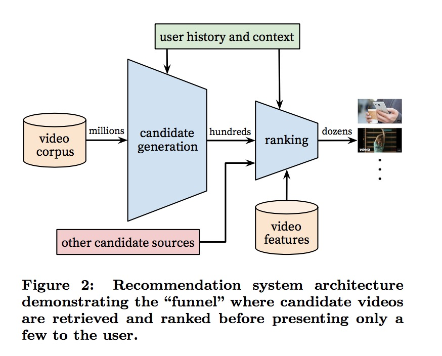
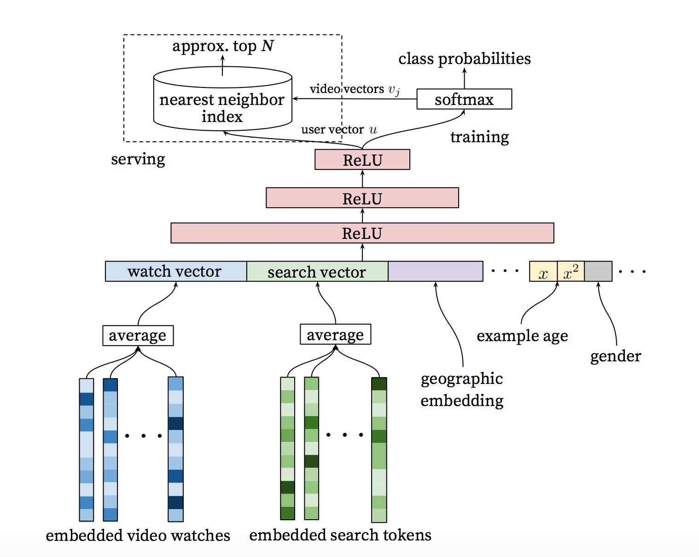
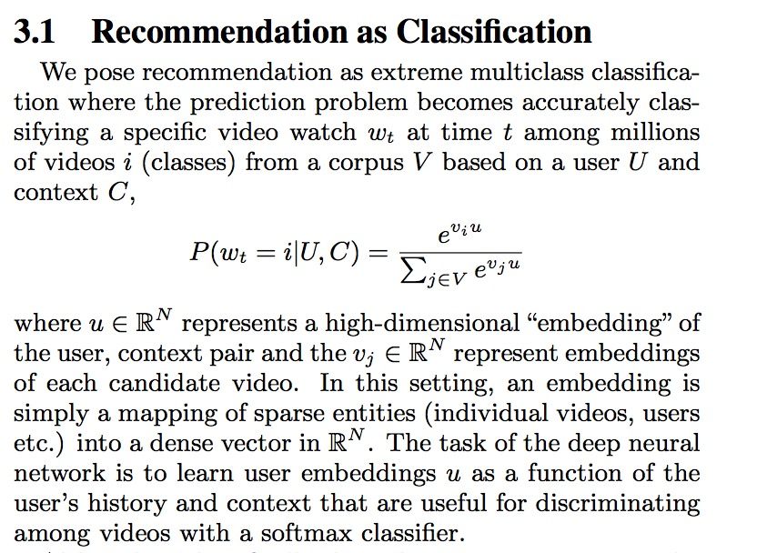
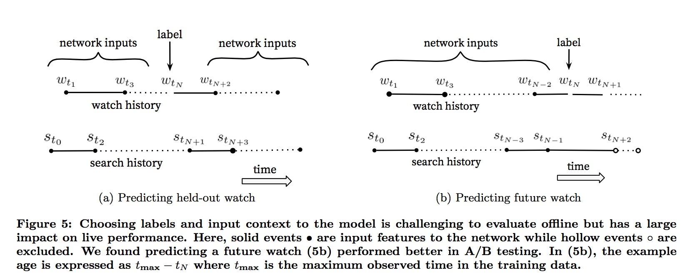
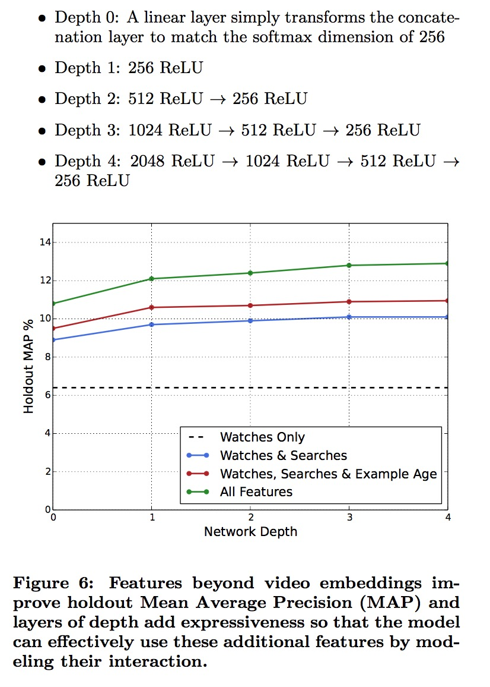
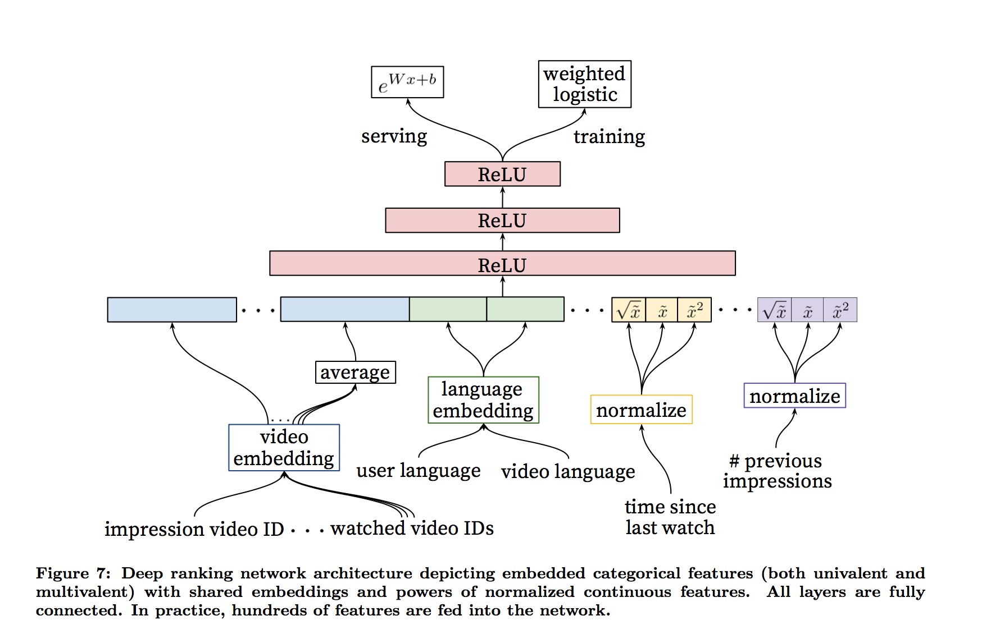

# Deep Neural Networks for YouTube Recommendations

## Keywords
Recommender system, deep learning, Youtube

## Architecture

## Candidate generation network

Inspired by continuous bag of words language models [14], we learn high dimensional embeddings for each video in a fixed vocabulary and feed these embeddings into a feedforward neural network. A user’s watch history is represented by a variable-length sequence of sparse video IDs which is mapped to a dense vector representation via the embeddings. The network requires fixed-sized dense inputs and simply averaging the embeddings performed best among sev- eral strategies (sum, component-wise max, etc.). Impor- tantly, the embeddings are learned jointly with all other model parameters through normal gradient descent backpropagation updates. Features are concatenated into a wide first layer, followed by several layers of fully connected Rectified Linear Units (ReLU) [6]. Figure 3 shows the general network architecture with additional non-video watch features described below.

### DNN over MF
A key advantage of using deep neural networks as a gener- alization of matrix factorization is that arbitrary continuous and categorical features can be easily added to the model.

### Example age feature
we feed the age of the training example as a feature during training. At serving time, this feature is set to zero (or slightly negative) to reflect that the model is making predictions at the very end of the training window.

### Label and Content Selection
1. <strong>Training examples are generated from all YouTube watches (even those embedded on other sites) rather than just watches on the recommendations we produce.</strong> Otherwise, it would be very difficult for new content to surface and the recom- mender would be overly biased towards exploitation.
2. Another key insight that improved live metrics was to <strong>generate a fixed number of training examples per user, effectively weighting our users equally in the loss function.</strong> This prevented a small cohort of highly active users from dominating the loss.
3. user has just issued a search query for “tay- lor swift”. Since our problem is posed as predicting the next watched video, a classifier given this information will predict that the most likely videos to be watched are those which appear on the corresponding search results page for “taylor swift”. Unsurpisingly, reproducing the user’s last search page as homepage recommendations performs very poorly. <strong>By discarding sequence information and representing search queries with an unordered bag of tokens</strong>, the classifier is no longer directly aware of the origin of the label.
4. Natural consumption patterns of videos typically lead to very asymmetric co-watch probabilities. Episodic series are usually watched sequentially and users often discover artists in a genre beginning with the most broadly popular before focusing on smaller niches. <strong>We therefore found much better performance predicting the user’s next watch, rather than predicting a randomly held-out watch (Figure 5).</strong> Many collaborative filtering systems implicitly choose the labels and context by holding out a random item and predicting it from other items in the user’s history (5a). This leaks future information and ignores any asymmetric consumption patterns. In contrast, we “rollback” a user’s history by choosing a ran- dom watch and only input actions the user took before the held-out label watch (5b).

## Experiments with Features and Depth
Adding features and depth significantly improves precision on holdout data as shown in Figure 6. In these experiments, a vocabulary of 1M videos and 1M search tokens were embedded with 256 floats each in a maximum bag size of 50 recent watches and 50 recent searches. The softmax layer outputs a multinomial distribution over the same 1M video classes with a dimension of 256 (which can be thought of as a separate output video embedding). These models were trained until convergence over all YouTube users, corresponding to several epochs over the data. Network structure followed a common “tower” pattern in which the bottom of the network is widest and each successive hidden layer halves the number of units (similar to Figure 3). The depth zero network is effectively a linear factorization scheme which
performed very similarly to the predecessor system. Width and depth were added until the incremental benefit diminished and convergence became difficult:

## Ranking network

### feature representing
Our features are segregated with the traditional taxonomy of categorical and continuous/ordinal features. The categorical features we use vary widely in their cardinality - some are binary (e.g. whether the user is logged-in) while others have millions of possible values (e.g. the user’s last search query). Features are further split according to whether they contribute only a single value (“univalent”) or a set of values (“multivalent”). An example of a univalent categorical fea- ture is the video ID of the impression being scored, while a corresponding multivalent feature might be a bag of the last N video IDs the user has watched. We also classify features according to whether they describe properties of the item (“impression”) or properties of the user/context (“query”). Query features are computed once per request while impression features are computed for each item scored.

### Embedding Categorical Features
<strong>Importantly, categorical features in the same ID space also share underlying emeddings. </strong>For example, there exists a sin- gle global embedding of video IDs that many distinct fea- tures use (video ID of the impression, last video ID watched by the user, video ID that “seeded” the recommendation, etc.). Despite the shared embedding, each feature is fed sep- arately into the network so that the layers above can learn specialized representations per feature. Sharing embeddings is important for improving generalization, speeding up train- ing and reducing memory requirements. The overwhelming majority of model parameters are in these high-cardinality embedding spaces - for example, one million IDs embedded in a 32 dimensional space have 7 times more parameters than fully connected layers 2048 units wide.

### Normalizing Continuous Features
Neural networks are notoriously sensitive to the scaling and distribution of their inputs [9] whereas alternative approaches such as ensembles of decision trees are invariant to scaling of individual features. We found that proper normalization of continuous features was critical for convergence. <strong>A con-
tinuous feature x with distribution f is transformed to x ̃ by
scaling the values such that the feature is equally distributed
in [0,1) using the cumulative distribution, x ̃ =  x df. −∞</strong>
This integral is approximated with linear interpolation on the quantiles of the feature values computed in a single pass over the data before training begins.
<strong>In addition to the raw normalized feature x ̃, we also input powers x ̃2 and √x ̃</strong>, giving the network more expressive power by allowing it to easily form super- and sub-linear functions of the feature. Feeding powers of continuous features was found to improve offline accuracy.

### Modeling Expected Watch Time
Our goal is to predict expected watch time given training examples that are either positive (the video impression was clicked) or negative (the impression was not clicked). Positive examples are annotated with the amount of time the user spent watching the video. To predict expected watch time we use the technique of <strong>weighted logistic regression</strong>, which was developed for this purpose.
The model is trained with logistic regression under cross-
entropy loss (Figure 7). <strong>However, the positive (clicked)
impressions are weighted by the observed watch time on
the video. Negative (unclicked) impressions all receive unit
weight. </strong>In this way, the odds learned by the logistic regression are sum(Ti)/N-k where N is the number of training examples, k is the number of positive impressions, and Ti is the watch time of the ith impression. Assuming the fraction of pos- itive impressions is small (which is true in our case), the learned odds are approximately E[T ](1 + P ), where P is the click probability and E[T] is the expected watch time of the impression. Since P is small, this product is close to E[T]. For inference we use the exponential function ex as the final activation function to produce these odds that closely estimate expected watch time.