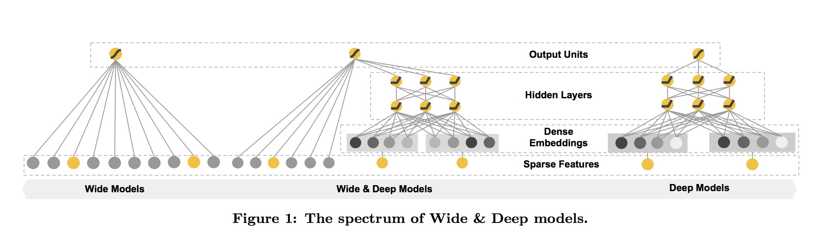
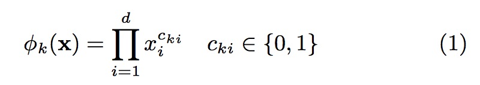
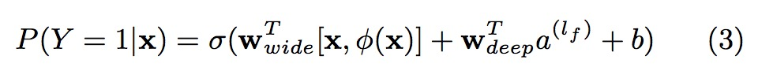
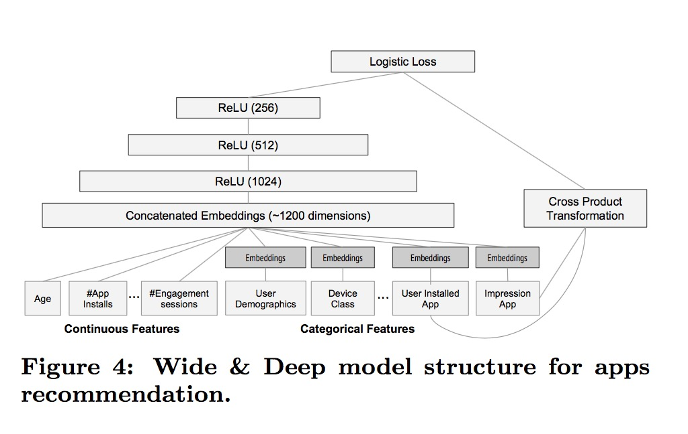

# Wide & Deep Learning for Recommender Systems

## Keywords
Recommender system, deep learning, Google App store

## Problem
With less feature engineering, deep neural networks can generalize bet- ter to unseen feature combinations through low-dimensional dense embeddings learned for the sparse features. However, deep neural networks with embeddings can over-generalize and recommend less relevant items when the user-item inter- actions are sparse and high-rank. 

Embedding-based models, such as factorization machines [5] or deep neural networks, can generalize to previously unseen query-item feature pairs by learning a low-dimensional dense embedding vector for each query and item feature, with less burden of feature engineering. However, it is difficult to learn effective low-dimensional representations for queries and items when the underlying query-item matrix is sparse and high-rank, such as users with specific preferences or niche items with a narrow appeal.

One challenge in recommender systems, similar to the general search ranking problem, is to achieve both memorization and generalization. Memorization can be loosely defined as learning the frequent co-occurrence of items or features and exploiting the correlation available in the historical data. Generalization, on the other hand, is based on transitivity of correlation and explores new feature combinations that have never or rarely occurred in the past. Recommendations based on memorization are usually more topical and directly relevant to the items on which users have already performed actions. Compared with memorization, general- ization tends to improve the diversity of the recommended items. In this paper, we focus on the apps recommendation problem for the Google Play store, but the approach should apply to generic recommender systems.

## Architecture

### The Wide Component
 The wide component is a generalized linear model of the form y = wT x + b, as illustrated in Figure 1 (left). y is the prediction, x = [x1, x2, ..., xd] is a vector of d features, w = [w1,w2,...,wd] are the model parameters and b is the bias. The feature set includes raw input features and transformed
features. One of the most important transformations is the cross-product transformation, which is defined as:

where cki is a boolean variable that is 1 if the i-th fea- ture is part of the k-th transformation φk, and 0 otherwise. For binary features, a cross-product transformation (e.g., “AND(gender=female, language=en)”) is 1 if and only if the constituent features (“gender=female” and “language=en”) are all 1, and 0 otherwise. This captures the interactions between the binary features, and adds nonlinearity to the generalized linear model.

### The Deep Component
The deep component is a feed-forward neural network, as shown in Figure 1 (right). For categorical features, the orig- inal inputs are feature strings (e.g., “language=en”). Each of these sparse, high-dimensional categorical features are first converted into a low-dimensional and dense real-valued vector, often referred to as an embedding vector. The di- mensionality of the embeddings are usually on the order of O(10) to O(100). The embedding vectors are initialized ran- domly and then the values are trained to minimize the final loss function during model training. These low-dimensional dense embedding vectors are then fed into the hidden layers of a neural network in the forward pass. Specifically, each hidden layer performs the following computation:
a(l+1) = f(W(l)a(l) + b(l)) (2)
where l is the layer number and f is the activation function, often rectified linear units (ReLUs). a(l) , b(l) , and W (l) are the activations, bias, and model weights at l-th layer.

### Joint Training vs Ensemble
In an ensemble, individual models are trained separately without knowing each other, and their predictions are combined only at inference time but not at training time. In contrast, joint training optimizes all parameters simultaneously by taking both the wide and deep part as well as the weights of their sum into account at training time. There are implications on model size too: For an ensemble, since the training is disjoint, each individual model size usually needs to be larger (e.g., with more features and transformations) to achieve reasonable accuracy for an ensemble to work. In comparison, for joint training the wide part only needs to complement the weaknesses of the deep part with a small number of cross-product feature transformations, rather than a full-size wide model.

### Joint Training of Wide and Deep Model
Joint training of a Wide & Deep Model is done by back- propagating the gradients from the output to both the wide and deep part of the model simultaneously using mini-batch stochastic optimization. In the experiments, we used Follow- the-regularized-leader (FTRL) algorithm [3] with L1 regu- larization as the optimizer for the wide part of the model, and AdaGrad [1] for the deep part.
The combined model is illustrated in Figure 1 (center). For a logistic regression problem, the model’s prediction is:

where Y is the binary class label, σ(·) is the sigmoid func- tion, φ(x) are the cross product transformations of the orig- inal features x, and b is the bias term. wwide is the vector of all wide model weights, and wdeep are the weights applied on the final activations a(lf ).

## Wide and Deep Model for Google App Store

### data generation
In this stage, user and app impression data within a period of time are used to generate training data. Each example corresponds to one impression. The label is app acquisition: 1 if the impressed app was installed, and 0 otherwise.
Vocabularies, which are tables mapping categorical fea- ture strings to integer IDs, are also generated in this stage. The system computes the ID space for all the string features that occurred more than a minimum number of times. Con- tinuous real-valued features are normalized to [0, 1] by map- ping a feature value x to its cumulative distribution function P (X ≤ x), divided into nq quantiles. The normalized value
is i−1 for values in the i-th quantiles. Quantile boundaries
are computed during data generation.

### model training
The model structure we used in the experiment is shown in Figure 4. During training, our input layer takes in training data and vocabularies and generate sparse and dense fea- tures together with a label. The wide component consists of the cross-product transformation of user installed apps and impression apps. For the deep part of the model, A 32- dimensional embedding vector is learned for each categorical feature. We concatenate all the embeddings together with the dense features, resulting in a dense vector of approxi- mately 1200 dimensions. The concatenated vector is then fed into 3 ReLU layers, and finally the logistic output unit.
The Wide & Deep models are trained on over 500 billion examples. Every time a new set of training data arrives, the model needs to be re-trained. However, retraining from scratch every time is computationally expensive and delays the time from data arrival to serving an updated model. To tackle this challenge, we implemented a warm-starting system which initializes a new model with the embeddings and the linear model weights from the previous model.
Before loading the models into the model servers, a dry run of the model is done to make sure that it does not cause problems in serving live traffic. We empirically validate the model quality against the previous model as a sanity check.

### model serving
Once the model is trained and verified, we load it into the model servers. For each request, the servers receive a set of app candidates from the app retrieval system and user features to score each app. Then, the apps are ranked from the highest scores to the lowest, and we show the apps to the users in this order. The scores are calculated by running a forward inference pass over the Wide & Deep model.
In order to serve each request on the order of 10 ms, we optimized the performance using multithreading parallelism by running smaller batches in parallel, instead of scoring all candidate apps in a single batch inference step.

